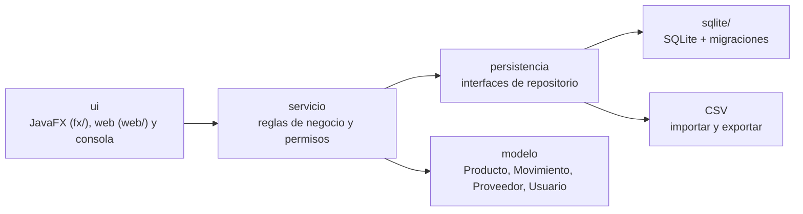
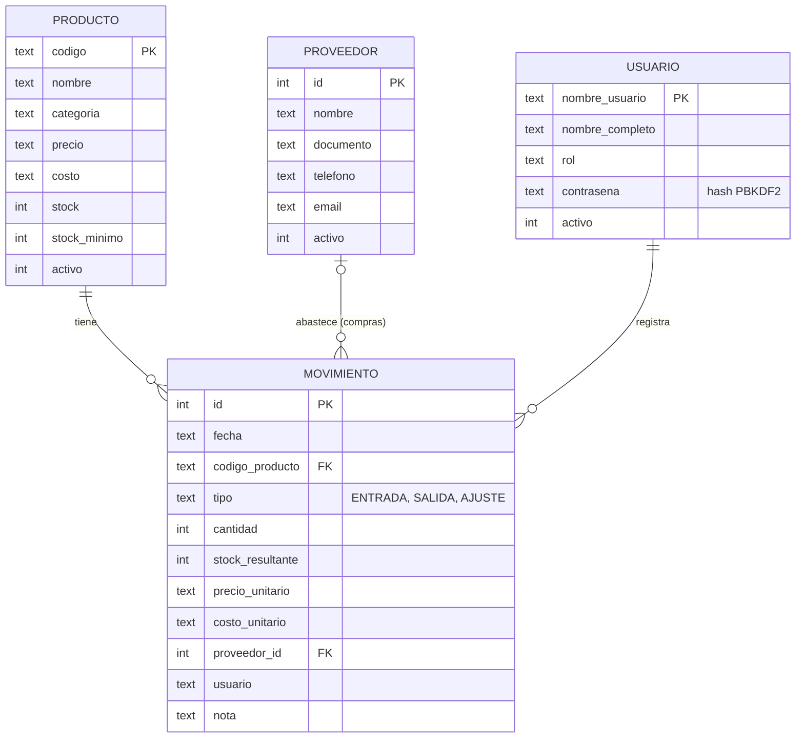
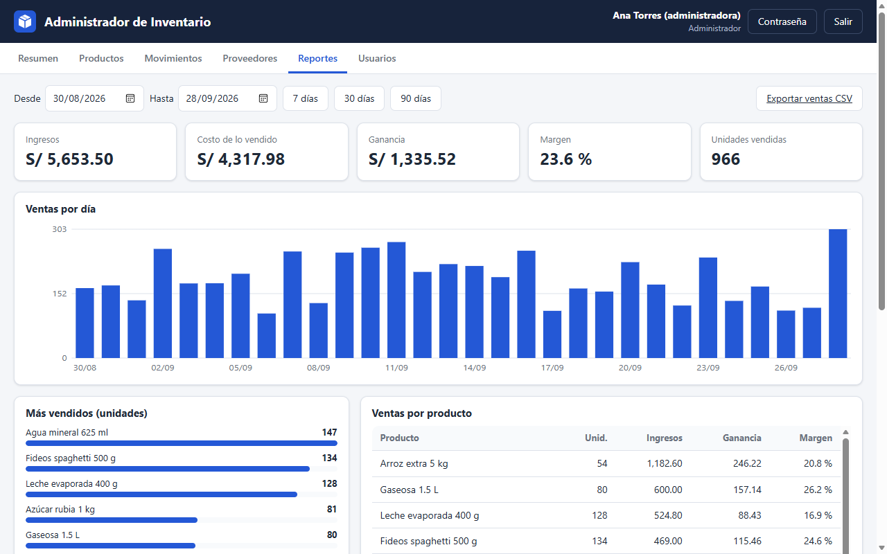
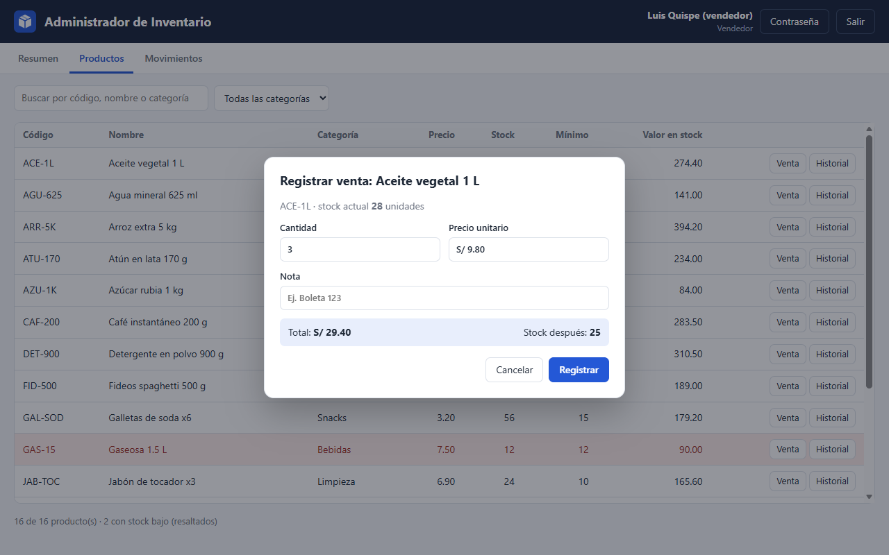

# Administrador de inventario

Aplicación para gestionar el inventario de un pequeño negocio: productos, stock, compras,
ventas, proveedores, reportes de ganancia y usuarios con roles.
Hecha en Java 26 con JavaFX, SQLite y Maven. Funciona de tres formas, con los mismos datos y las mismas reglas:

- **Escritorio:** ventana JavaFX, instalable como programa de Windows que se abre con un clic.
- **Web:** servidor Javalin y una página que se usa desde el navegador (PC o teléfono).
- **Consola:** menú de texto con productos, stock, proveedores, reportes (y exportación CSV), usuarios y copias de seguridad.


## Funcionalidades

| Área | Qué permite |
| --- | --- |
| Productos | Alta, edición, baja lógica y reactivación; búsqueda y filtro por categoría; precio, costo y margen; importar y exportar CSV |
| Stock | Compras (con proveedor y costo), ventas, ajustes por conteo físico; costo promedio ponderado; historial por producto |
| Venta rápida | Pestaña para el mostrador: cada lectura del lector de código de barras (o el código escrito + Enter) suma al ticket; `3*CÓDIGO` agrega varias unidades; «Cobrar» registra todo el ticket junto o nada |
| Alertas | Productos en o por debajo del stock mínimo resaltados en rojo y listados en el Resumen |
| Proveedores | Registro con validación de RUC/DNI y correo; baja lógica |
| Reportes | Ventas, costo, ganancia y margen por período; gráfico diario; más vendidos; productos sin rotación; compras por proveedor; exportación a CSV (Excel) e impresión o PDF («Imprimir…» → «Microsoft Print to PDF») |
| Usuarios | Inicio de sesión, roles Administrador y Vendedor, cambio y restablecimiento de contraseña |
| Auditoría | Cada movimiento guarda fecha, usuario, cantidades, precio y costo |
| Datos | Base SQLite con migraciones automáticas y transacciones; importa los CSV de versiones anteriores |
| Registro de actividad | `registro0.log` en la carpeta de datos: arranques, accesos, copias y errores |
| Copias de seguridad | Pestaña Usuarios → «Crear copia de seguridad» (en la web, «Descargar copia de seguridad»): un archivo `.db` con todos los datos, creado sin cerrar el programa |

### Roles

| Permiso | Administrador | Vendedor |
| --- | :---: | :---: |
| Consultar productos y movimientos | ✔ | ✔ |
| Registrar ventas | ✔ | ✔ |
| Registrar compras y ajustes | ✔ | |
| Gestionar productos y proveedores | ✔ | |
| Ver reportes, costos y márgenes | ✔ | |
| Gestionar usuarios | ✔ | |
| Crear copias de seguridad | ✔ | |

Los permisos se verifican en la capa de servicio, así que se cumplen igual desde la ventana, la web y la consola.

### Restaurar una copia de seguridad

La copia es la base de datos completa (productos, movimientos, proveedores y usuarios con sus contraseñas, así que
guárdela en un lugar seguro). Para restaurarla: cierre el programa, renombre `inventario.db` de la carpeta de datos
(por si acaso) y copie ahí el archivo de respaldo con el nombre `inventario.db`.

### Registro de actividad

En la carpeta de datos, `registro0.log` anota cada arranque, los inicios de sesión (y los intentos fallidos), las
copias de seguridad y los errores inesperados con su detalle técnico. Si algo falla, ese archivo dice qué pasó.
Al llegar a 1 MB pasa a `registro1.log` (se conservan 3 archivos); nunca se borra al abrir el programa.

## Ejecutar

Solo se necesita el **JDK 26**. El Maven Wrapper (`mvnw`) descarga Maven y las librerías la primera vez.
En PowerShell se usa `.\mvnw.cmd` en lugar de `./mvnw`.

```sh
./mvnw package                                                                  # compila, prueba y genera el JAR
java -jar target/administrador-de-inventario-1.0-SNAPSHOT.jar --demo            # ventana, datos de ejemplo en ./demo
java -jar target/administrador-de-inventario-1.0-SNAPSHOT.jar                   # ventana, datos reales en ./data
java -jar target/administrador-de-inventario-1.0-SNAPSHOT.jar --web --demo      # web en http://localhost:7070
java -jar target/administrador-de-inventario-1.0-SNAPSHOT.jar --consola         # menú de texto
java -jar target/administrador-de-inventario-1.0-SNAPSHOT.jar otra/ruta         # carpeta de datos alternativa
./mvnw test                                                                     # solo las pruebas
```

Opciones: `--web` (servidor), `--puerto=8080` (o variable de entorno `PORT`), `--consola`, `--demo` y una
carpeta de datos. Se pueden combinar: `--web --demo --puerto=8080 mis-datos`.

Desde IntelliJ: abrir la carpeta (se importa como proyecto Maven) y elegir arriba a la derecha una de las
configuraciones incluidas: **Inventario (demo)**, **Inventario** o **Inventario (consola)**. Ya traen la opción
de JVM `--enable-native-access=ALL-UNNAMED`, que evita los avisos de Java 26 al cargar JavaFX y SQLite.
Para la web, duplicar una y agregar `--web` a los argumentos del programa.

- **Modo demostración (`--demo`):** crea un minimarket con 16 productos, 4 proveedores y 60 días de
  movimientos. Usuarios: `admin` / `admin123` y `vendedor` / `vendedor123`.
- **Primera ejecución con datos reales:** la aplicación pide crear el usuario administrador.

### Cómo se ejecuta por dentro

1. `Main` lee los argumentos (`Opciones`) y elige el modo: ventana (JavaFX), `--web` o `--consola`.
2. `Aplicacion` abre `inventario.db` (SQLite) en la carpeta de datos, aplica las migraciones pendientes
   (`db/V1.sql`, `V2.sql`…) y, con `--demo`, carga los datos de ejemplo si la base está vacía.
3. Crea los repositorios SQLite y los servicios (`InventarioServicio`, `ReporteServicio`…). Cada servicio recibe
   una `Sesion`: guarda quién inició sesión y se consulta antes de cada operación protegida.
4. La interfaz elegida solo llama a los servicios:
   - la **ventana** usa una única sesión (una persona a la vez);
   - el **servidor web** crea una sesión por navegador (guardada en una cookie) y responde JSON en `/api/...`;
     la página (`resources/inventario/ui/web/publico`) pide los datos con `fetch` y dibuja las pantallas.

## Aplicación de escritorio (un clic)

`empaquetado/crear-app-escritorio.ps1` usa **jpackage** (viene con el JDK) para crear
`Administrador de Inventario.exe` con su propio Java incluido: quien la usa no necesita instalar Java.

```powershell
powershell -ExecutionPolicy Bypass -File empaquetado\crear-app-escritorio.ps1
```

El script compila y prueba, crea la aplicación en `target\escritorio`, la copia en
`%LOCALAPPDATA%\Programs\Administrador de Inventario` y crea accesos directos en el **Escritorio** y en el
**menú Inicio**. También instala **Inventario Web (servidor)**, que inicia la versión web con un clic
(cerrar su ventana detiene el servidor).

- Los datos de la aplicación instalada se guardan en `%USERPROFILE%\AdministradorInventario\data`,
  así que reinstalar no los borra.
- `-SinInstalar` solo genera la carpeta, para copiarla a otra PC (se abre con el `.exe` de adentro).
- `-Tipo exe` o `-Tipo msi` genera un instalador clásico de Windows; requiere [WiX Toolset](https://wixtoolset.org).
- Para cambiar el ícono: editar `empaquetado/GenerarIcono.java` y ejecutar `java empaquetado/GenerarIcono.java`.

## Versión en línea

En la red local ya funciona: al iniciar `--web` (o **Inventario Web**) en una PC, las demás computadoras y
teléfonos de la misma red entran con `http://IP-de-esa-PC:7070` (la IP se ve con `ipconfig`; la primera vez
Windows pregunta si permite el acceso en el firewall).

Para usarla **desde cualquier lugar por Internet** hay que ejecutarla en un servidor. El `Dockerfile` incluido
sirve para servicios como Render, Railway o Fly.io, o para un VPS propio:

```sh
docker build -t inventario .
docker run -p 7070:7070 -v inventario-datos:/datos inventario
```

- **Guarde los datos en un disco persistente** (volumen en `/datos`); sin él, se pierden al reiniciar.
- **Use HTTPS.** Esos servicios lo dan automáticamente; en un VPS, ponga delante nginx o Caddy.
- La primera vez pide crear el administrador: hágalo apenas publique la página, con una contraseña segura.
- El servidor usa el puerto de la variable `PORT` si el servicio la define.

### Seguridad de la versión web

- Contraseñas con PBKDF2 (igual que en escritorio). Tras 5 intentos fallidos se bloquea ese usuario 2 minutos.
- Sesión en una cookie `HttpOnly` y `SameSite=Strict` (y `Secure` con HTTPS); vence tras 8 horas sin uso.
- Los cambios exigen la cabecera `X-Inventario`, que un formulario de otro sitio no puede enviar (CSRF).
- Si un administrador desactiva a un usuario o le cambia el rol, se aplica en su sesión abierta al instante.
- A quien no puede ver reportes nunca se le envían costos ni márgenes, aunque consulte la API directamente.
- Cabeceras `Content-Security-Policy`, `X-Frame-Options` y `nosniff`; todo texto se escapa antes de mostrarse.

## Arquitectura



```
src/main/java/inventario/
├── Main.java, Opciones.java   Punto de entrada y argumentos
├── Aplicacion.java            Arma la aplicación: base de datos, sesión y servicios
├── DatosDemo.java             Datos de ejemplo (--demo)
├── modelo/                    Producto, Movimiento, Proveedor, Usuario, Rol, Permiso
├── persistencia/              Interfaces de repositorio, CSV (importar/exportar), Transacciones
│   └── sqlite/                BaseDeDatos, Migraciones y repositorios SQLite
├── servicio/                  InventarioServicio, ProveedorServicio, ReporteServicio,
│                              UsuarioServicio, Sesion, Contrasenas
└── ui/                        MenuConsola, fx/ (ventana, pestañas y diálogos)
                               y web/ (ServidorWeb, Rutas de la API, Json)
src/main/resources/
├── db/V1.sql … V3.sql         Scripts de migración del esquema
├── inventario/ui/fx/          estilos.css e icono.png de la ventana
└── inventario/ui/web/publico/ Página web: index.html, app.js, estilos.css, icono.svg
empaquetado/                   Script de jpackage, ícono .ico y su generador
Dockerfile                     Imagen de la versión web para publicarla en línea
```

Decisiones de diseño:

- **Capas.** La interfaz solo usa servicios y los servicios solo usan interfaces de repositorio. Así se
  pasó de CSV a SQLite, y se agregó la versión web, sin tocar las reglas de negocio.
- **Una sesión por persona conectada.** `Aplicacion.serviciosPara(Sesion)` crea servicios propios para cada
  navegador; la ventana y la consola usan una sola.
- **Peticiones web de a una.** SQLite usa una sola conexión, así que el servidor atiende la API en orden;
  para un negocio pequeño sobra y evita que dos ventas simultáneas descuenten mal el stock.
- **Dinero con `BigDecimal`.** Se guarda como texto en la base para no perder decimales.
- **Transacciones.** El cambio de stock y su movimiento se guardan juntos o no se guarda ninguno.
- **Migraciones versionadas (`PRAGMA user_version`).** Una base de una versión anterior se actualiza sola al abrirla.
- **Contraseñas con PBKDF2-HMAC-SHA256** (210 000 iteraciones, sal aleatoria por usuario).
- **Bajas lógicas.** Los productos, proveedores y usuarios dados de baja conservan su historial.

## Modelo de datos



## Pruebas

128 pruebas JUnit 5 (`./mvnw test`) cubren:

- reglas de stock, costos y márgenes;
- permisos por rol;
- contraseñas;
- reportes;
- importación y exportación;
- repositorios CSV y SQLite, incluidas transacciones, claves foráneas y migraciones;
- copias de seguridad con la base abierta;
- la API web de punta a punta: sesiones por navegador, permisos, costos ocultos y protección CSRF.

## Capturas

| Productos | Reportes |
| --- | --- |
|  |  |

| Inicio de sesión | Vista del vendedor |
| --- | --- |
|  |  |

| Web: reportes | Web: registrar venta |
| --- | --- |
|  |  |
