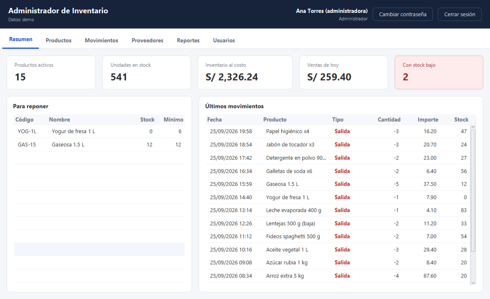
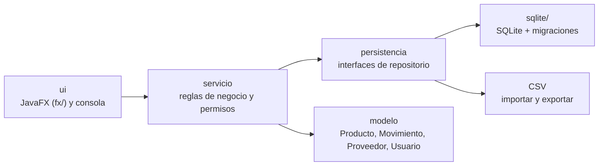
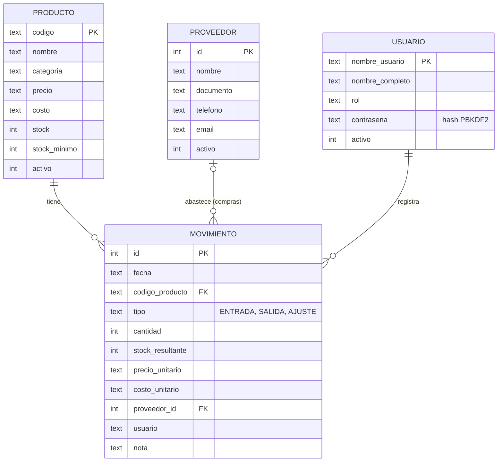
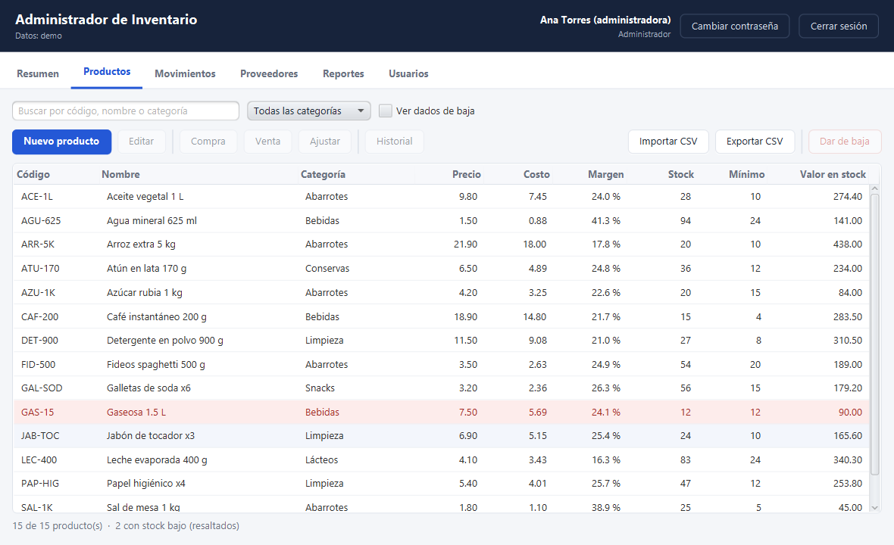
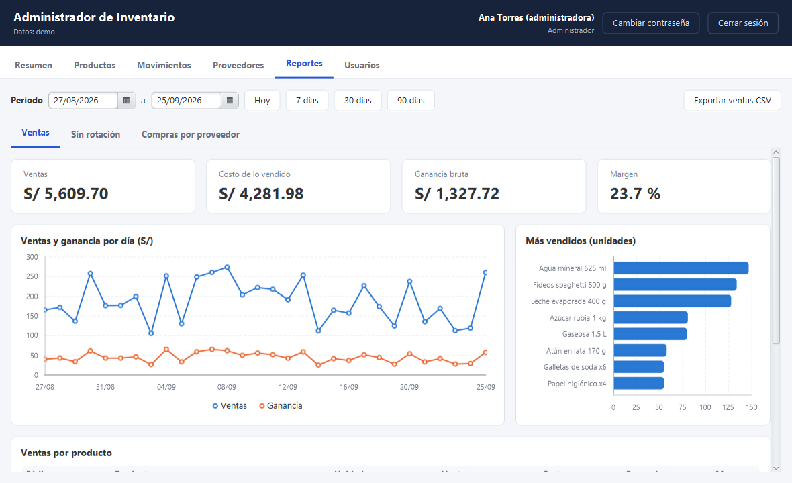
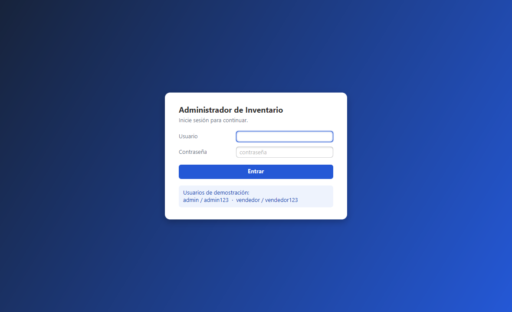
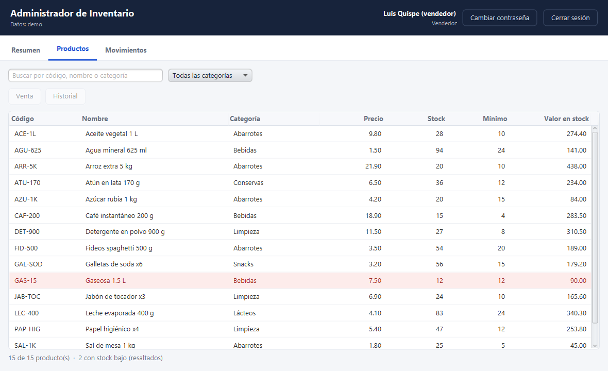

# Administrador de inventario

Aplicación de escritorio para gestionar el inventario de un pequeño negocio: productos, stock, compras,
ventas, proveedores, reportes de ganancia y usuarios con roles.
Hecha en Java 26 con JavaFX, SQLite y Maven.



## Funcionalidades

| Área | Qué permite |
| --- | --- |
| Productos | Alta, edición, baja lógica y reactivación; búsqueda y filtro por categoría; precio, costo y margen; importar y exportar CSV |
| Stock | Compras (con proveedor y costo), ventas, ajustes por conteo físico; costo promedio ponderado; historial por producto |
| Alertas | Productos en o por debajo del stock mínimo resaltados en rojo y listados en el Resumen |
| Proveedores | Registro con validación de RUC/DNI y correo; baja lógica |
| Reportes | Ventas, costo, ganancia y margen por período; gráfico diario; más vendidos; productos sin rotación; compras por proveedor; exportación a CSV (Excel) |
| Usuarios | Inicio de sesión, roles Administrador y Vendedor, cambio y restablecimiento de contraseña |
| Auditoría | Cada movimiento guarda fecha, usuario, cantidades, precio y costo |
| Datos | Base SQLite con migraciones automáticas y transacciones; importa los CSV de versiones anteriores |

### Roles

| Permiso | Administrador | Vendedor |
| --- | :---: | :---: |
| Consultar productos y movimientos | ✔ | ✔ |
| Registrar ventas | ✔ | ✔ |
| Registrar compras y ajustes | ✔ | |
| Gestionar productos y proveedores | ✔ | |
| Ver reportes, costos y márgenes | ✔ | |
| Gestionar usuarios | ✔ | |

Los permisos se verifican en la capa de servicio, así que se cumplen igual desde la ventana y desde la consola.

## Ejecutar

Solo se necesita el **JDK 26**. El Maven Wrapper (`mvnw`) descarga Maven y las librerías la primera vez.

```sh
./mvnw package                                                            # compila, prueba y genera el JAR
java -jar target/administrador-de-inventario-1.0-SNAPSHOT.jar --demo      # datos de ejemplo en ./demo
java -jar target/administrador-de-inventario-1.0-SNAPSHOT.jar             # datos reales en ./data
java -jar target/administrador-de-inventario-1.0-SNAPSHOT.jar --consola   # menú de texto
java -jar target/administrador-de-inventario-1.0-SNAPSHOT.jar otra/ruta   # carpeta de datos alternativa
./mvnw test                                                               # solo las pruebas
```

En PowerShell se usa `.\mvnw.cmd` en lugar de `./mvnw`.

Desde IntelliJ: abrir la carpeta (se importa como proyecto Maven) y elegir arriba a la derecha una de las
configuraciones incluidas: **Inventario (demo)**, **Inventario** o **Inventario (consola)**. Ya traen la opción
de JVM `--enable-native-access=ALL-UNNAMED`, que evita los avisos de Java 26 al cargar JavaFX y SQLite.

- **Modo demostración (`--demo`):** crea un minimarket con 16 productos, 4 proveedores y 60 días de
  movimientos. Usuarios: `admin` / `admin123` y `vendedor` / `vendedor123`.
- **Primera ejecución con datos reales:** la aplicación pide crear el usuario administrador.

## Arquitectura



```
src/main/java/inventario/
├── Main.java, Opciones.java   Punto de entrada y argumentos
├── Aplicacion.java            Arma la aplicación: base de datos, sesión y servicios
├── DatosDemo.java             Datos de ejemplo (--demo)
├── modelo/                    Producto, Movimiento, Proveedor, Usuario, Rol, Permiso
├── persistencia/              Interfaces de repositorio, CSV (importar/exportar), Transacciones
│   └── sqlite/                BaseDeDatos, Migraciones y repositorios SQLite
├── servicio/                  InventarioServicio, ProveedorServicio, ReporteServicio,
│                              UsuarioServicio, Sesion, Contrasenas
└── ui/                        MenuConsola y fx/ (ventana, pestañas y diálogos)
src/main/resources/
├── db/V1.sql … V3.sql         Scripts de migración del esquema
└── inventario/ui/fx/estilos.css
```

Decisiones de diseño:

- **Capas.** La interfaz solo usa servicios y los servicios solo usan interfaces de repositorio. Así se
  pasó de CSV a SQLite sin tocar las reglas de negocio.
- **Dinero con `BigDecimal`.** Se guarda como texto en la base para no perder decimales.
- **Transacciones.** El cambio de stock y su movimiento se guardan juntos o no se guarda ninguno.
- **Migraciones versionadas (`PRAGMA user_version`).** Una base de una versión anterior se actualiza sola al abrirla.
- **Contraseñas con PBKDF2-HMAC-SHA256** (210 000 iteraciones, sal aleatoria por usuario).
- **Bajas lógicas.** Los productos, proveedores y usuarios dados de baja conservan su historial.

## Modelo de datos



## Pruebas

115 pruebas JUnit 5 (`./mvnw test`) cubren:

- reglas de stock, costos y márgenes;
- permisos por rol;
- contraseñas;
- reportes;
- importación y exportación;
- repositorios CSV y SQLite, incluidas transacciones, claves foráneas y migraciones.

## Capturas

| Productos | Reportes |
| --- | --- |
|  |  |

| Inicio de sesión | Vista del vendedor |
| --- | --- |
|  |  |
